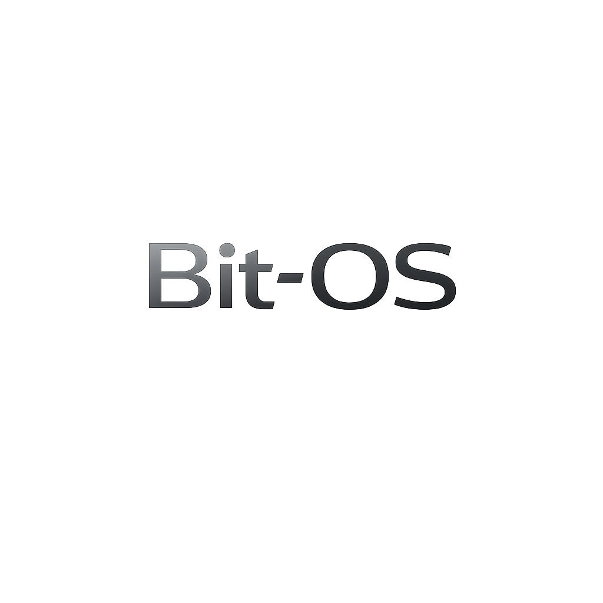
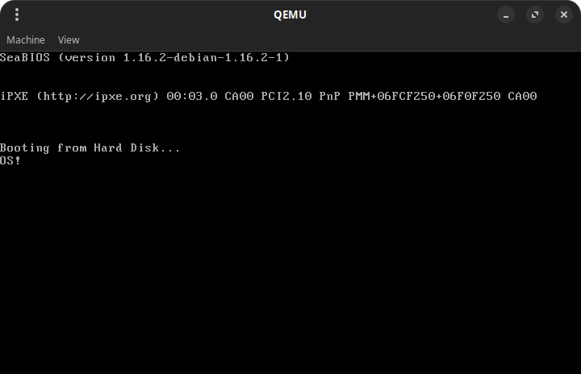

<p align="center" >
  
</p>

# 🖥️ BitOS - Educational Operating System

<p align="center">
  
  
  
  
  
  
  
</p>

<p align="center">
  <a href="#-technologies">Technologies</a>&nbsp;&nbsp;&nbsp;|&nbsp;&nbsp;&nbsp;
  <a href="#-project">Project</a>&nbsp;&nbsp;&nbsp;|&nbsp;&nbsp;&nbsp;
  <a href="#-layout">Layout</a>&nbsp;&nbsp;&nbsp;|&nbsp;&nbsp;&nbsp;
  <a href="#-license">License</a>
</p>

<p align="center">
  
</p>

<p align="center">
  
</p>

A minimal, x86-based operating system built from scratch for learning purposes. This project demonstrates the fundamentals of low-level programming, the bootloading process, and kernel entry using **C** and **Assembly**.

## 🛠️ Project Structure
* `boot.asm`: The x86 assembly bootloader (16-bit real mode).
* `kernel.c`: The main kernel logic written in C.
* `os.bin`: The final combined OS image.

## 🚀 Getting Started

### Prerequisites
You will need the following tools installed:
* **NASM**: For assembling the bootloader.
* **GCC**: For compiling the C kernel.
* **LD**: The GNU linker.
* **QEMU**: To emulate the hardware and run the OS.

> [!IMPORTANT]
> Before building, ensure you have the necessary tools installed. On Ubuntu or Debian-based systems, run:

```bash
sudo apt install nasm gcc qemu-system-x86
```

### 🔨 Compilation & Build
Follow these steps to compile the source code and create the bootable image:

1.  **Assemble the Bootloader:**
    ```bash
    nasm -f bin boot.asm -o boot.bin
    ```

2.  **Compile the Kernel:**
    ```bash
    gcc -ffreestanding -m32 -fno-pie -fno-stack-protector -c kernel.c -o kernel.o
    ```

3.  **Link the Kernel:**
    ```bash
    ld -m elf_i386 -Ttext 0x1000 --oformat binary kernel.o -o kernel.bin
    ```

4.  **Create the OS Image:**
    ```bash
    cat boot.bin kernel.bin > os.bin
    ```

### 💻 Running the OS
To launch your operating system using the QEMU emulator, run:

```bash
qemu-system-x86_64 -drive format=raw,file=os.bin
```

## 📚 Learning Goals
* Understanding the BIOS boot sequence.
* Transitioning from Real Mode to Protected Mode.
* Writing hardware drivers (like VGA text buffers) in C.
* Memory management and linking conventions.

## 🫶 Contributing

Contributions are welcome! Please feel free to submit a Pull Request.

## 📝 License

This project is under the MIT license.

<p align="center">
  Made with ♥ by me
</p>
